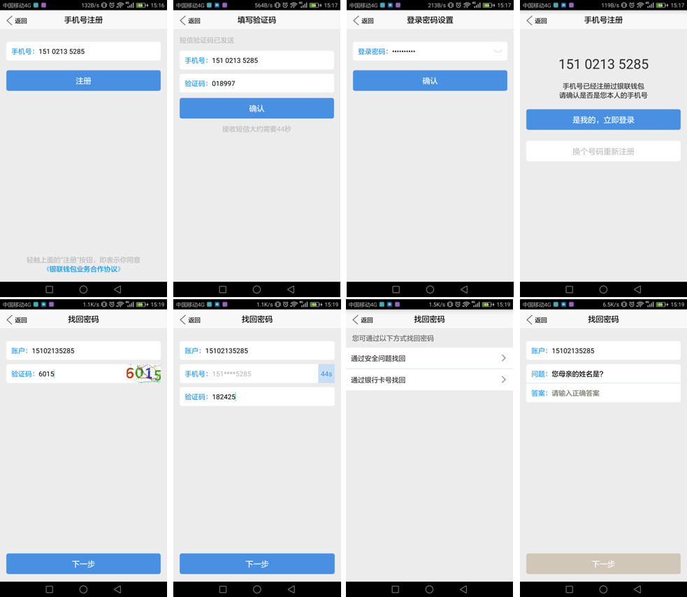
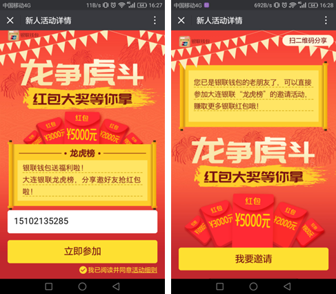
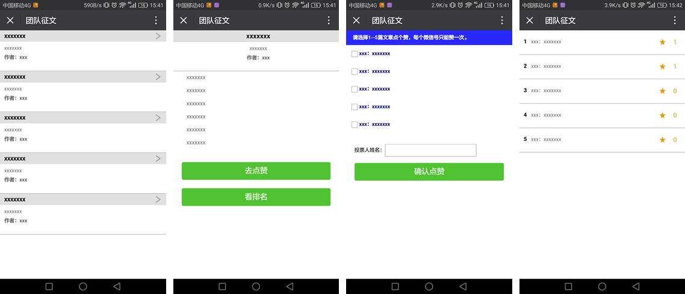
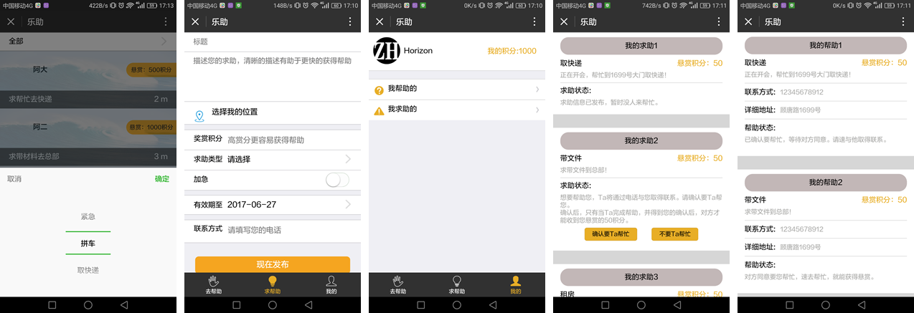

部分移动端页面在PC上打开时，Chrome上请按F12。

# 2017年

1.基于[React Native](http://facebook.github.io/react-native/)的[银联钱包管家](http://sj.qq.com/myapp/detail.htm?apkName=com.unionpay.seller)中注册、找回密码功能。

2.[LeetCode Java刷题](https://github.com/zhhgit/leetCode-practice)。

3.[H5病毒营销](https://wallet.95516.com/s/wl/web/activity/vMarketing2/html/snsIndex.html)及配置工具（Chrome扩展程序）。

4.云闪付APP中新用户注册流程。

5.云闪付APP中公共缴费、手机充值的缴费记录。

6.[银联浙江分公司商圈管理平台](https://zj.95516.com/bdp/web/login/html/login.html)的登录、日志、人员、机构、权限管理部分（PC端，前后端分离）。

7.[团队征文投票](https://github.com/zhhgit/vote)（小程序、H5各实现一版，后台PHP）。

8.[Android系列练手demos](http://zhanghao90.cn/blog/android/android-demos)。

9.[云闪付62送红包活动](https://wallet.95516.com/s/wl/web/activity/bonus/html/bonus.html)(6笔6元领36元红包)。

10.云闪付APP开放平台（OAUTH联登、JS-SDK部分）。

11.[交易查询平台](https://ctq.95516.com/web/kfmms/html/wxIndex.html)。

12.[工会百日立功活动](https://wallet.95516.com/s/wl/web/activity/union/html/unionMain.html)。

13.云闪付APP中动账营销：刮刮卡、点宝箱抽奖

14.动账营销配置工具

15.[快速登录注册](https://youhui.95516.com/hybrid_v3/easy/html/easy_do.html)

16.三人成团新用户营销：转轮抽奖

# 2016年

1.云闪付APP中[汇率计算](https://wallet.95516.com/s/wl/web/402/page/life/exchange.html)。

2.微信公众号“云账单”、“普惠金融一网通”中[H5微信信用卡还款](https://wallet.95516.com/s/wl/web/3rdH5/creditPay/html/creditPay.html)。

3.React移动端前端组件库：Toast([React-toast](https://github.com/zhhgit/react_toast))、Button、List。

4.Hackathon项目：[“乐助”微信小程序](https://github.com/zhhgit/lezhu)。

5.云闪付APP中信用卡账单分期(业务目前支持民生银行、北京银行、渤海银行等银行)。

