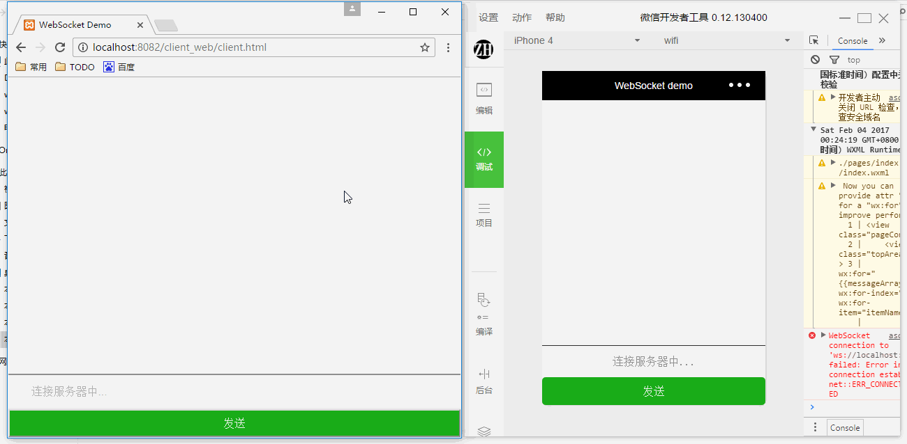

浏览器与微信小程序的跨端聊天室，如图。

# 一、浏览器WebSocket

client.html:

    <!DOCTYPE html>
    <head>
        <meta charset="utf-8">
        <meta name="viewport" content="width=device-width,minimum-scale=1.0,maximum-scale=1.0"/>
        <title>WebSocket Demo</title>
        <link type="text/css" href="./client.css" rel="stylesheet" />
    </head>
    <body>
        

            

            

            

                

                    <input type="text" placeholder="连接服务器中..." class="message" id="inputMessage"/>
                

                <button class="sendButton" id="sendButton">发送</button>
            

        

        
        
    </body>
    </html>

client.js:

    (function($){
        console.log("将要连接服务器。");
        var wsUri ="ws://localhost:8080/";
        var socketOpen = false;
        var messageArray = [];
        websocket = new WebSocket(wsUri);
        websocket.onopen = function(res) {
            console.log("连接服务器成功。");
            $("#inputMessage").attr("placeholder","连接服务器成功，请输入姓名。");
            socketOpen = true;
        };
        websocket.onclose = function(res) {
            console.log("断开连接。");

        };
        websocket.onmessage = function(res) {
            console.log('收到服务器内容：' + res.data);
            var data = res.data;
            var dataArray = data.split("_");
            var newMessage = {
                type:dataArray[0],
                name:dataArray[1],
                time:dataArray[2],
                message:dataArray[3]
            };
            var newArray = messageArray.concat(newMessage);
            messageArray = newArray;
            reBuild(messageArray);
        };

        websocket.onerror = function(res) {
            console.log("连接错误。");
        };

        $("#sendButton").on("click",function () {
            var message = $("#inputMessage").val();
            if(message!=''){
                $("#inputMessage").attr("placeholder","请输入信息");
                sendSocketMessage(message);
                $("#inputMessage").val("");
            }
        });

        function sendSocketMessage(message) {
            if(socketOpen){
                websocket.send(message);
            }
        }

        function reBuild(messageArray) {
            $("#topArea").empty();
            var htmlDom = "";
            for(var i in messageArray){
                if(messageArray[i].type == 'self'){
                    htmlDom+='

'
                        + messageArray[i].name+ " "
                        + messageArray[i].time
                        + '

'
                        + messageArray[i].message
                        + '

';
                }
                else{
                    htmlDom+='

'
                        + messageArray[i].name+ " "
                        + messageArray[i].time
                        + '

'
                        + messageArray[i].message
                        + '

';
                }
            }
            htmlDom+='

'
            $("#topArea").append(htmlDom);
        }

    })(Zepto);

# 二、微信小程序WebSocket

index.wxml:

    <view class="pageContainer">
        <view class="topArea">
            <view wx:for="{{messageArray}}" wx:for-index="idx" wx:for-item="itemName">
                <view class="selfMessage" wx:if="{{itemName.type == 'self'}}">
                    <view class="nameInfo">{{itemName.name+ " " + itemName.time}}</view>
                    <view class="detailMessage">{{itemName.message}}</view>
                </view>
                <view class="otherMessage" wx:else>
                    <view class="nameInfo">{{itemName.name+ " " + itemName.time}}</view>
                    <view class="detailMessage">{{itemName.message}}</view>
                </view>
                <view class="clear"></view>
            </view>
        </view>
        <view class="bottomArea">
            <form bindreset="send">
                <view class="inputArea">
                    <input type="text" placeholder="{{placeholderText}}" class="message" bindinput="bindKeyInput"/>
                </view>
                <button size="default" type="primary" form-type="reset" class="sendButton">发送</button>
            </form>
        </view>
    </view>

index.js:

    Page({
        data: {
            placeholderText:"连接服务器中...",
            messageArray:[],
            socketOpen:false,
            inputValue:""
        },
        onLoad: function(options) {
            var self = this;
            console.log("将要连接服务器。");
            wx.connectSocket({
                url: 'ws://localhost:8080'
            });

            wx.onSocketOpen(function(res) {
                console.log("连接服务器成功。");
                self.setData({
                    placeholderText:"连接服务器成功，请输入姓名。",
                    socketOpen:true
                });
            });

            wx.onSocketMessage(function(res) {
                console.log('收到服务器内容：' + res.data);
                var data = res.data;
                var dataArray = data.split("_");
                var newMessage = {
                    type:dataArray[0],
                    name:dataArray[1],
                    time:dataArray[2],
                    message:dataArray[3]
                };
                var newArray = self.data.messageArray.concat(newMessage);
                self.setData({
                    messageArray:newArray,
                    placeholderText:"请输入信息"
                });
            });
        },

        onUnload: function() {
            wx.closeSocket();
        },

        bindKeyInput: function(e) {
            this.setData({
                inputValue: e.detail.value
            });
        },

        send: function() {
            if(this.data.inputValue!=""){
                this.sendSocketMessage(this.data.inputValue);
                this.setData({
                    inputValue:""
                });
            }
        },

        sendSocketMessage:function (msg){
            if (this.data.socketOpen) {
                wx.sendSocketMessage({
                    data:msg
                })
            }
        }
    });

# 三、服务端

WebSocket服务端基于[ws](https://github.com/websockets/ws)库实现，server.js:

    const WebSocket = require('ws');
    const util = require("util");
    const wss = new WebSocket.Server({ port: 8080 });
    console.log("WebSocket服务端已启动。");

    wss.on('connection', function connection(socket) {
        console.log("有新客户端连接!");

        // 构造客户端对象
        var newclient = {
            socket:socket,
            name:false
        };

        socket.on('message', function incoming(msg) {
            var currentTime = getTime();
            // 判断是不是第一次连接，以第一条消息作为用户名
            if(!newclient.name){
                newclient.name = msg;
                wss.clients.forEach(function each(client) {
                    if (client.readyState === WebSocket.OPEN) {
                        client.send("welcome_系统管理员_" + currentTime + "_欢迎" + msg + "加入聊天！");
                    }
                });
                console.log(newclient.name + "加入聊天。");
            }
            else{
                wss.clients.forEach(function each(client) {
                    if (client !== socket && client.readyState === WebSocket.OPEN) {
                        client.send("other_" + newclient.name + "_" + currentTime + "_" + msg);
                    }
                    else if(client == socket){
                        client.send("self_" + newclient.name + "_" + currentTime + "_" + msg);
                    }
                    console.log(newclient.name + "于" + currentTime + "说：" + msg);
                });
            }
        });

        socket.on('close', function close() {
            var currentTime = getTime();
            wss.clients.forEach(function each(client) {
                if (client.readyState === WebSocket.OPEN) {
                    client.send("leave_系统管理员_" + currentTime + "_" + newclient.name + "离开聊天！");
                }
                console.log(newclient.name + "离开聊天。");
            });
        });
    });

    var getTime=function(){
      var date = new Date();
      return date.getHours()+":"+date.getMinutes()+":"+date.getSeconds();
    };

# 四、参考

1.[ws](https://github.com/websockets/ws)

2.[Socket.io在线聊天室](http://blog.fens.me/nodejs-socketio-chat/)

3.[socket.io](https://github.com/socketio/socket.io)

4.[weapp-demo-websocket](https://github.com/CFETeam/weapp-demo-websocket)

5.[刨根问底HTTP和WebSocket协议](http://www.jianshu.com/p/0e5b946880b4)