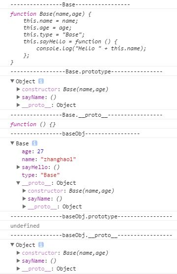

# 一、例子

	function Base(name,age) {
	    this.name = name;
	    this.age = age;
	    this.type = "Base";
	    this.sayHello = function () {
	        console.log("Hello " + this.name);
	    };
	}
	Base.prototype.sayName = function () {
	    console.log("My name is " + this.name);
	};
	baseObj = new Base("zhanghao1",27);

	console.log("----------------Base-----------------");
	console.log(Base);

	console.log("-----------------Base.prototype----------------");
	console.log(Base.prototype);

	console.log("----------------Base.__proto__-----------------");
	console.log(Base.__proto__);

	console.log("----------------baseObj-----------------");
	console.log(baseObj);

	console.log("----------------baseObj.prototype-----------------");
	console.log(baseObj.prototype);

	console.log("----------------baseObj.__proto__-----------------");
	console.log(baseObj.__proto__);

显示如下：

# 二、分析

# 三、参考

1.[JS原型](http://blog.csdn.net/wxw_317/article/details/49617767)