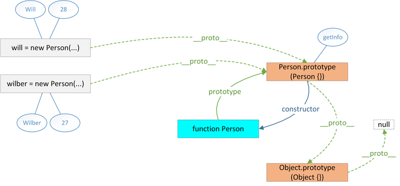

# 一、例子

	function Base(name,age) {
	    this.name = name;
	    this.age = age;
	    this.type = "Base";
	    this.sayHello = function () {
	        console.log("Hello " + this.name);
	    };
	}
	Base.prototype.sayName = function () {
	    console.log("My name is " + this.name);
	};
	baseObj = new Base("zhanghao1",27);

	console.log("----------------Base-----------------");
	console.log(Base);

	console.log("-----------------Base.prototype----------------");
	console.log(Base.prototype);

	console.log("----------------Base.__proto__-----------------");
	console.log(Base.__proto__);

	console.log("----------------baseObj-----------------");
	console.log(baseObj);

	console.log("----------------baseObj.prototype-----------------");
	console.log(baseObj.prototype);

	console.log("----------------baseObj.__proto__-----------------");
	console.log(baseObj.__proto__);

显示如下：

# 二、分析

Base是函数对象，所以输出的是一个函数。Base.prototype是Base的原型，该对象有三个属性。constructor指向Base函数对象。sayName属性是动态添加的。__proto__指向Object.prototype。因为函数对象也是一个对象。Base.__proto__为Function.prototype，是Function这个函数对象的原型。baseObj为new出来的Base实例，拥有构造函数中的属性和方法。当调用sayName方法时，在属性中无法找到，就去__proto__中找，所谓“原型链”。baseObj.prototype为undefined，因为baseObj不是函数对象，所以没有prototype。baseObj.__proto__保存的是构造函数的原型，也就是Base.prototype。

借用两张图和比较经典的总结

1.所有的对象都有"\_\_proto\_\_"属性，该属性对应该对象的原型。

2.所有的函数对象都有"prototype"属性，该属性的值会被赋值给该函数创建的对象的"\_\_proto\_\_"属性。

3.所有的原型对象都有"constructor"属性，该属性对应创建所有指向该原型的实例的构造函数。

4.函数对象和原型对象通过"prototype"和"constructor"属性进行相互关联。

# 三、参考

1.[彻底理解JavaScript原型](http://blog.csdn.net/wxw_317/article/details/49617767)