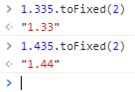

# 一、IEEE 754规范

《JavaScript权威指南》中的说法：和其他编程语言不同，JavaScript不区分整数值和浮点数。JavaScript中的所有数字均用浮点值表示。JavaScript采用IEEE 754标准定义的64位浮点格式表示数字。实数有无数个，但JavaScript通过浮点数的形式只能表示其中有限的个数。也就是说，当在JavaScript中使用实数的时候，通常只是真实值的一个近似表示。IEEE 754二进制表示法，可以精确地表示分数，比如1/2,1/4等。遗憾的是，我们常用的分数（特别是金融计算方面）都是十进制分数1/10,1/100等。二进制浮点数表示法并不能精确表示类似0.1这样简单的数字。这个问题不只在JavaScript中才会出现，理解这一点非常重要：在任何使用二进制浮点数的编程语言中都有这个问题。这种计算结果可以胜任绝大多数的计算任务，这个问题也只有在比较两个值是否相等的时候才会出现。

根据国际标准IEEE 754，任意一个二进制浮点数V可以表示成下面的形式，对于64位的浮点数，最高的1位是符号位S，接着的11位是指数E，剩下的52位为有效数字M。

    (-1)^s表示符号位，当s=0，V为正数；当s=1，V为负数。
    2^E表示指数位。
    M表示有效数字，大于等于1，小于2。

因为M可以写成1.xxxxxxxxx的形式，其中xxxxxxxxx表示小数部分。IEEE 754规定，在计算机内部保存M时，默认这个数的第一位总是1，因此可以被舍去，只保存后面的xxxxxxxxx部分。比如保存1.01的时候，只保存01，等到读取的时候，再把第一位的1加上去。

如果E为11位，它的取值范围为0~2047。但是科学计数法中的E是可以出现负数的，所以IEEE 754规定，E的真实值必须再减去一个中间数，对于11位的E，这个中间数是1023。比如，2^10的E是10，所以保存成64位浮点数时，必须保存成10+1023=1033，即10000001001。

指数E还可以再分成三种情况：

(1)E不全为0或不全为1。这时，浮点数就采用上面的规则表示，即指数E的计算值减去1023，得到真实值，再将有效数字M前加上第一位的1；(2)E全为0。这时，浮点数的指数E等于1-1023，有效数字M不再加上第一位的1，而是还原为0.xxxxxxxxx的小数。这样做是为了表示±0，以及接近于0的很小的数字；(3)E全为1。这时，如果有效数字M全为0，表示±无穷大（正负取决于符号位s）；如果有效数字M不全为0，表示这个数不是一个数（NaN）。

# 二、典型问题和解决办法

1.不稳定的toFixed()方法

NumberObject.toFixed(num)：num必需。规定小数的位数，是 0 ~ 20 之间的值，包括 0 和 20，有些实现可以支持更大的数值范围。如果省略了该参数，将用 0 代替。

并非期望中的四舍五入

解决思路：把小数乘以数倍，放大到整数，再缩小回原来精度。

	Number.prototype.toFixed = function( fractionDigits )  {
	    //没有对fractionDigits做任何处理，假设它是合法输入 
	    return (parseInt(this * Math.pow( 10, fractionDigits  ) + 0.5)/Math.pow(10,fractionDigts)).toString();  
	}

或者

	function round2(num,fractionDigits){
		return Math.round(num*Math.pow(10,fractionDigits))/Math.pow(10,fractionDigits); 
	}

2.浮点数比较

	0.1  ===>  0.0001  1001  1001  1001…（1001循环）
	0.2  ===>  0.0011  0011  0011  0011…（0011循环）

建议：(1)不要直接进行数值的比较；(2)放大到整数后处理；(3)使用Math对象的round()/floor()/ceil()等方法。

3.大数问题

尾数位最大是 52 位，因此 JS 中能精准表示的最大整数是 Math.pow(2, 53)，十进制即 9007199254740992，大于 9007199254740992 的可能会丢失精度。

	9007199254740992  	===>  10000000000000...000 // 共计 53 个 0
	9007199254740992 + 1  ===>  10000000000000...001 // 中间 52 个 0
	9007199254740992 + 2  ===>  10000000000000...010 // 中间 51 个 0
	9007199254740992 + 3  ===>  10000000000000...011 // 中间 51 个 0
	9007199254740992 + 4  ===>  10000000000000...100 // 中间 50 个 0

4.浮点数运算误差积累

parseInt()的输入要求是字符串，所以JavaScript对刚才那两个计算结果做toString()类型转换操作。并且，当parseInt发现有字符串中有一个字母不是数字，就把这个字母和后面的都丢弃。

可以用Math.round(1097.12*100)

# 三、参考

1.[JavaScript数字精度丢失问题总结](https://www.cnblogs.com/snandy/p/4943138.html)

2.[程序员必知之浮点数运算原理详解](http://blog.csdn.net/tercel_zhang/article/details/52537726)