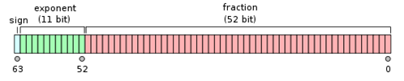
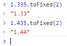
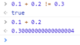
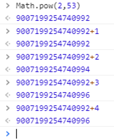
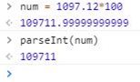
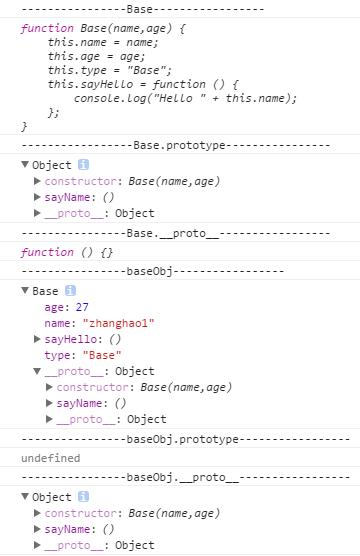
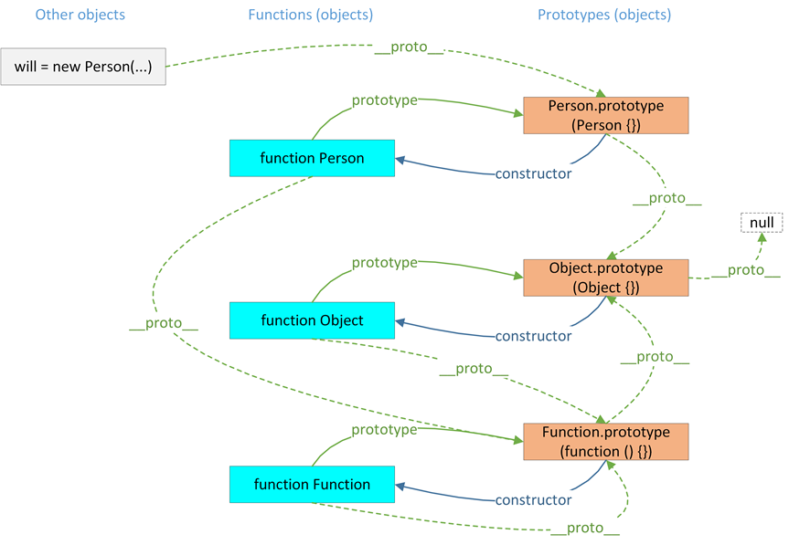
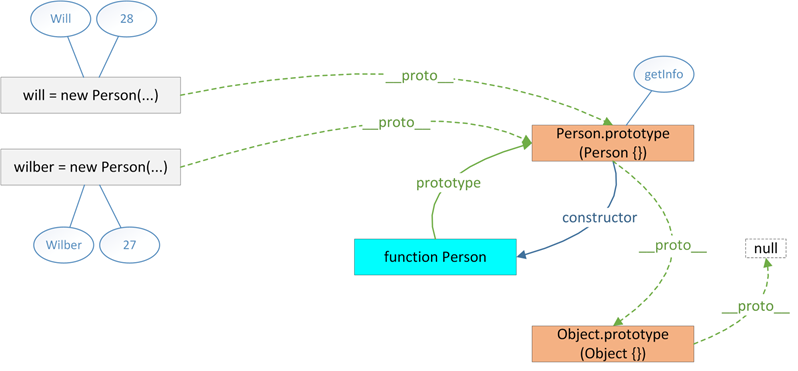
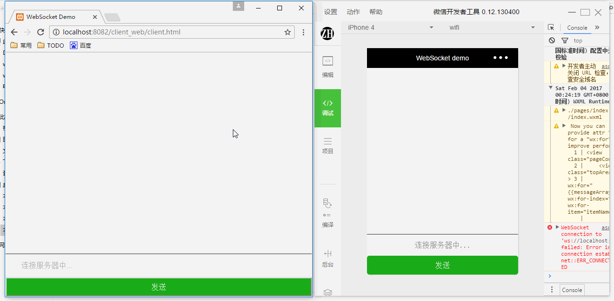

# JavaScript

1.apply&call&bind

传递参数并非apply()和call()真正的用武之地；它们真正强大的地方是能够扩充函数赖以运行的作用域。参考《JavaScript高级程序设计》P116。

(1)apply

apply()方法接收两个参数：一个是在其中运行函数的作用域，另一个是参数数组。

	function sum(num1, num2){
		return num1 + num2;
	}
	function callSum1(num1, num2){
		return sum.apply(this, arguments); // 传入arguments 对象
	}
	function callSum2(num1, num2){
		return sum.apply(this, [num1, num2]); // 传入数组
	}
	alert(callSum1(10,10)); //20
	alert(callSum2(10,10)); //20

(2)call

call()方法与apply()方法的作用相同，它们的区别仅在于接收参数的方式不同。对于call()方法而言，第一个参数是this 值没有变化，变化的是其余参数都直接传递给函数。

	function sum(num1, num2){
		return num1 + num2;
	}
	function callSum(num1, num2){
		return sum.call(this, num1, num2);
	}
	alert(callSum(10,10)); //20

(3)bind

[Javascript中bind()方法的使用与实现](https://segmentfault.com/a/1190000002662251)

[bind 方法 (Function) (JavaScript)](https://msdn.microsoft.com/zh-cn/library/ff841995)

2.JavaScript模块化

不同于C，Java等语言，当前浏览器广泛支持的JavaScript版本ECMAScript 5并没有类似于include，import这样的关键字来实现代码的模块化管理。但是随着前端代码的越发复杂和工程化，JS模块化编程已经成为一种迫切的需求。
JS模块化有助于前端代码的解耦与重用。下面分成如下三个部分介绍。

(1)常用模式

a.第一种常用的模式是通过一个构造函数，将一些可以被使用的公开方法暴露出去。例如commonUI.js为：

	var CommonUI = function () {

		//这里可以定义一些私有的变量和函数

	    return {
	    	//暴露公开的成员

	        //显示Loading弹层
	        showLoading : function (msg) {
	            //TODO Loading具体实现
	        },
	        //显示Toast弹层
	        showToast : function (msg, time) {
	            //TODO Toast具体实现
	        },
	        //显示Alert弹层
	        showAlert : function (message, okCallback, cancelCallback, okText, cancelText,titleText) {
	            //TODO Alert具体实现
	        }
	    };

	};

在HTML页面中引用该JS文件，在另外的JS文件中通过如下方式可以使用CommonUI.js中暴露出去的方法。每次用的时候都要通过new新产生一个实例，然后通过该实例调用方法。

	var commonui = new CommonUI();
	commonui.showLoading("加载中");

b.第二种常用的模式是通过匿名闭包，这种模式是当前前端代码中最常用的JS模块化的方式。通过匿名闭包的模式可以避免对全局的污染，将用到的变量限制在function作用域。如下的commonUI.js为一段典型的匿名闭包代码，一个匿名函数被定义后立即执行。在全局变量window下的子模块window.UP.W.UI中定义了showLoading(),showToast(),showAlert这三种常用的UI方法。

	(function ($, UP) {

	    //全局变量window下的UI子模块
	    UP.W = UP.W || {};
	    UP.W.UI = UP.W.UI || {};

	    //显示Loading弹层
	    UP.W.UI.showLoading = function (msg) {
	        //TODO Loading具体实现
	    };

	    //显示Toast弹层
	    UP.W.UI.showToast = function (msg, time) {
	        //TODO Toast具体实现
	    };

	    //显示Alert弹层
	    UP.W.UI.showAlert = function (message, okCallback, cancelCallback, okText, cancelText,titleText) {
	        //TODO Alert具体实现
	    };

	})(jQuery, window.UP = window.UP || {});

让当前模块成为全局变量的一个子模块意味着：只要在HTML页面中引用该JS文件，不需要其他的特别处理，在其他的JS文件中可以直接调用该JS文件中定义的方法。

	window.UP.W.UI.showLoading("加载中");

(2)模块规范

第一部分中实现JS的模块化主要依赖于JavaScript的语言特性。上述的模式，尤其是匿名闭包简单好用，但是也存在一定的问题。当需要引用的模块逐渐增多时，HTML代码中就要引入一堆的JS文件。而且这样的方式不易管理模块之间的依赖关系。
为了解决这样的问题，主要发展出了三种Javascript模块规范：CommonJS规范、AMD(Asynchronous Module Definition)规范、CMD(Common Module Definition)规范。

a.CommonJS规范

CommonJS规范主要应用于JavaScript服务器端编程，Node.js就是符合CommomJS规范的。CommonUI.js可以如下定义，通过exports向外暴露一些方法。

	exports = {
	    //显示Loading弹层
	    showLoading : function (msg) {
	        //TODO Loading具体实现
	    },
	    //显示Toast弹层
	    showToast : function (msg, time) {
	        //TODO Toast具体实现
	    },
	    //显示Alert弹层
	    showAlert : function (message, okCallback, cancelCallback, okText, cancelText,titleText) {
	        //TODO Alert具体实现
	    }
	};

通过全局性方法require()可以使用CommonUI.js模块中定义的方法。

	var ui= require("CommonUI");
	ui.showLoading("加载中");

CommonJS规范中代码是同步加载的，也就是说第一行require("CommonUI")加载完之后，才能执行第二行的showLoading方法。如果CommonJS.js很大，加载时间很长，整个应用出现“假死”状态。
这对服务器端不是一个问题，因为文件都是从磁盘读取的，速度很快。但在浏览器端，带宽成为了程序执行的主要瓶颈。因此浏览器端不建议使用CommonJS的规范。

b.AMD规范

符合AMD规范的模块管理工具主要有RequireJS。可以通过如下方式定义一个模块。

	define(function(){
	    return {
	        //显示Loading弹层
	        showLoading : function (msg) {
	            //TODO Loading具体实现
	        },
	        //显示Toast弹层
	        showToast : function (msg, time) {
	            //TODO Toast具体实现
	        },
	        //显示Alert弹层
	        showAlert : function (message, okCallback, cancelCallback, okText, cancelText,titleText) {
	            //TODO Alert具体实现
	        }
	    }
	});

使用CommonUI.js模块的方法如下。这里的require函数有两个参数，第一个参数是一个数组，里面的成员就是要加载的模块；第二个参数是加载成功之后的回调函数。所谓异步是指，require函数不会等待两个模块加载完成，而会继续执行后面的其他代码console.log("other")。当CommonUI.js模块加载完成之后，再通过回调函数调用showLoading方法。

	require(["CommonUI"], function (ui) {
	    ui.showLoading("加载中");
	});
	//TODO 其他代码
	console.log("other");

c.CMD规范

CMD规范是在SeaJS推广过程中产生的，由阿里的玉伯提出。一个符合CMD规范的模块如下。通过require函数引入需要使用的模块，通过module.exports向外暴露公共方法。

	define(function (requie, exports, module) {

	    //加载CommonUI模块
	    var ui = require('CommonUI');
	    ui.showLoading("加载中");

	    //加载CommonUtil模块
	    var util = require('CommonUtil');
	    util.add();

	    module.exports = {
	        demo : function(){
	            //TODO demo具体实现
	        }
	    }
	});

SeaJS和RequireJs的区别在于：RequireJS中依赖一开始就加载，SeaJS对模块的态度是懒执行, 依赖可以就近书写，当需要用到时再去加载。

(3)ES6中的模块

ES6(ECMAScript 6)是JavaScript语言的下一代标准，已经于2015年6月正式发布。服务器端的Node.js中已经支持了ES6中的很多新特性，但是目前大部分的浏览器对于ES6的支持还不是很好，只能通过babel等工具将ES6语法转换成浏览器支持的ES5语法。ES6中原生地引入了模块的概念。相信用不了特别长的时间JS开发者就可以这样优雅地写一个JS模块。

	import {showLoading,showToast,showAlert} from './CommonUI'

	    showLoading("加载中");

	    var util = {
	        add : function () {
	            //TODO add具体实现
	        },
	        minus : function () {
	            //TODO minus具体实现
	        }
	    };

	export {util};

(4)参考链接

常用模式：

[Javascript模块化编程（一）：模块的写法](http://www.ruanyifeng.com/blog/2012/10/javascript_module.html)

SeaJS：

[使用SeaJS实现模块化JavaScript开发](http://blog.codinglabs.org/articles/modularized-javascript-with-seajs.html)

[模块化JS编程 seajs简单例子](http://www.itnose.net/detail/6074887.html)

[快速上手seajs——简单易用Seajs](http://www.tuicool.com/articles/3uIZzy)

[Seajs简易文档](http://yslove.net/seajs/)

RequireJS：

[JS模块化工具requirejs教程](http://www.runoob.com/w3cnote/requirejs-tutorial-1.html)

AMD & CMD：

[AMD 和 CMD 的区别有哪些？](http://www.zhihu.com/question/20351507/answer/14859415)

[SeaJS与RequireJS最大的区别](https://www.douban.com/note/283566440/)

[CommonJS，AMD，CMD区别](http://zccst.iteye.com/blog/2215317)

ES6：

[ECMAScript 6 Module](http://es6.ruanyifeng.com/#docs/module)

3.JavaScript数字精度

(1)IEEE 754规范

《JavaScript权威指南》中的说法：和其他编程语言不同，JavaScript不区分整数值和浮点数。JavaScript中的所有数字均用浮点值表示。JavaScript采用IEEE 754标准定义的64位浮点格式表示数字。实数有无数个，但JavaScript通过浮点数的形式只能表示其中有限的个数。
也就是说，当在JavaScript中使用实数的时候，通常只是真实值的一个近似表示。IEEE 754二进制表示法，可以精确地表示分数，比如1/2,1/4等。遗憾的是，我们常用的分数（特别是金融计算方面）都是十进制分数1/10,1/100等。二进制浮点数表示法并不能精确表示类似0.1这样简单的数字。
这个问题不只在JavaScript中才会出现，理解这一点非常重要：在任何使用二进制浮点数的编程语言中都有这个问题。这种计算结果可以胜任绝大多数的计算任务，这个问题也只有在比较两个值是否相等的时候才会出现。

根据国际标准IEEE 754，任意一个二进制浮点数V可以表示成下面的形式，对于64位的浮点数，最高的1位是符号位S，接着的11位是指数E，剩下的52位为有效数字M。

    (-1)^s表示符号位，当s=0，V为正数；当s=1，V为负数。
    2^E表示指数位。
    M表示有效数字，大于等于1，小于2。

因为M可以写成1.xxxxxxxxx的形式，其中xxxxxxxxx表示小数部分。IEEE 754规定，在计算机内部保存M时，默认这个数的第一位总是1，因此可以被舍去，只保存后面的xxxxxxxxx部分。比如保存1.01的时候，只保存01，等到读取的时候，再把第一位的1加上去。

如果E为11位，它的取值范围为0~2047。但是科学计数法中的E是可以出现负数的，所以IEEE 754规定，E的真实值必须再减去一个中间数，对于11位的E，这个中间数是1023。比如，2^10的E是10，所以保存成64位浮点数时，必须保存成10+1023=1033，即10000001001。

指数E还可以再分成三种情况：

    (1)E不全为0或不全为1。这时，浮点数就采用上面的规则表示，即指数E的计算值减去1023，得到真实值，再将有效数字M前加上第一位的1；
    (2)E全为0。这时，浮点数的指数E等于1-1023，有效数字M不再加上第一位的1，而是还原为0.xxxxxxxxx的小数。这样做是为了表示±0，以及接近于0的很小的数字；
    (3)E全为1。这时，如果有效数字M全为0，表示±无穷大（正负取决于符号位s）；如果有效数字M不全为0，表示这个数不是一个数（NaN）。

(2)典型问题和解决办法

a.不稳定的toFixed()方法

NumberObject.toFixed(num)：num必需。规定小数的位数，是 0 ~ 20 之间的值，包括 0 和 20，有些实现可以支持更大的数值范围。如果省略了该参数，将用 0 代替。

并非期望中的四舍五入

解决思路：把小数乘以数倍，放大到整数，再缩小回原来精度。

	Number.prototype.toFixed = function( fractionDigits )  {
	    //没有对fractionDigits做任何处理，假设它是合法输入 
	    return (parseInt(this * Math.pow( 10, fractionDigits  ) + 0.5)/Math.pow(10,fractionDigts)).toString();  
	}

或者

	function round2(num,fractionDigits){
		return Math.round(num*Math.pow(10,fractionDigits))/Math.pow(10,fractionDigits); 
	}

b.浮点数比较

	0.1  ===>  0.0001  1001  1001  1001…（1001循环）
	0.2  ===>  0.0011  0011  0011  0011…（0011循环）

建议：(1)不要直接进行数值的比较；(2)放大到整数后处理；(3)使用Math对象的round()/floor()/ceil()等方法。

c.大数问题

尾数位最大是 52 位，因此 JS 中能精准表示的最大整数是 Math.pow(2, 53)，十进制即 9007199254740992，大于 9007199254740992 的可能会丢失精度。

	9007199254740992  	===>  10000000000000...000 // 共计 53 个 0
	9007199254740992 + 1  ===>  10000000000000...001 // 中间 52 个 0
	9007199254740992 + 2  ===>  10000000000000...010 // 中间 51 个 0
	9007199254740992 + 3  ===>  10000000000000...011 // 中间 51 个 0
	9007199254740992 + 4  ===>  10000000000000...100 // 中间 50 个 0

d.浮点数运算误差积累

parseInt()的输入要求是字符串，所以JavaScript对刚才那两个计算结果做toString()类型转换操作。并且，当parseInt发现有字符串中有一个字母不是数字，就把这个字母和后面的都丢弃。

可以用Math.round(1097.12*100)

(3)参考

[JavaScript数字精度丢失问题总结](https://www.cnblogs.com/snandy/p/4943138.html)

[程序员必知之浮点数运算原理详解](http://blog.csdn.net/tercel_zhang/article/details/52537726)

4.JavaScript原型

(1)例子

	function Base(name,age) {
	    this.name = name;
	    this.age = age;
	    this.type = "Base";
	    this.sayHello = function () {
	        console.log("Hello " + this.name);
	    };
	}
	Base.prototype.sayName = function () {
	    console.log("My name is " + this.name);
	};
	baseObj = new Base("zhanghao1",27);

	console.log("----------------Base-----------------");
	console.log(Base);

	console.log("-----------------Base.prototype----------------");
	console.log(Base.prototype);

	console.log("----------------Base.__proto__-----------------");
	console.log(Base.__proto__);

	console.log("----------------baseObj-----------------");
	console.log(baseObj);

	console.log("----------------baseObj.prototype-----------------");
	console.log(baseObj.prototype);

	console.log("----------------baseObj.__proto__-----------------");
	console.log(baseObj.__proto__);

显示如下：

(2)分析

Base是函数对象，所以输出的是一个函数。Base.prototype是Base的原型，该对象有三个属性。constructor指向Base函数对象。sayName属性是动态添加的。__proto__指向Object.prototype。因为函数对象也是一个对象。Base.__proto__为Function.prototype，是Function这个函数对象的原型。baseObj为new出来的Base实例，拥有构造函数中的属性和方法。当调用sayName方法时，在属性中无法找到，就去__proto__中找，所谓“原型链”。baseObj.prototype为undefined，因为baseObj不是函数对象，所以没有prototype。baseObj.__proto__保存的是构造函数的原型，也就是Base.prototype。

借用两张图和比较经典的总结

    1.所有的对象都有"\_\_proto\_\_"属性，该属性对应该对象的原型。
    2.所有的函数对象都有"prototype"属性，该属性的值会被赋值给该函数创建的对象的"\_\_proto\_\_"属性。
    3.所有的原型对象都有"constructor"属性，该属性对应创建所有指向该原型的实例的构造函数。
    4.函数对象和原型对象通过"prototype"和"constructor"属性进行相互关联。

(3)参考

[彻底理解JavaScript原型](http://blog.csdn.net/wxw_317/article/details/49617767)

# 跨域

1.Chrome开启跨域模式

Win10：新建ChromeData目录，在chrome快捷方式，目标里如下设置

    C:\Users\xyzq\AppData\Local\Google\Chrome\Application\chrome.exe --disable-web-security --user-data-dir=C:\Users\xyzq\AppData\Local\Google\ChromeData

2.解决方法

(1)[JavaScript跨域总结与解决办法](http://www.cnblogs.com/rainman/archive/2011/02/20/1959325.html)

(2)[js中几种实用的跨域方法原理详解](http://www.cnblogs.com/2050/p/3191744.html)

(3)[jsonp](http://baike.baidu.com/link?url=vHvnmBChdWRbahcsoHl-RXzfRUg1VU1YXMqqySm4pstfUHJnHeU15IwQUxNgltn_cbroiwtKxQoRFHwBayfQAa)

(4)[JSONP 教程](http://www.runoob.com/json/json-jsonp.html)

(5)[AJAX 跨域请求 - JSONP获取JSON数据](http://justcoding.iteye.com/blog/1366102/)

# 正则表达式

1.典型正则

    // 创建
    new RegExp("regexp","g")
    // 或者
    /regexp/g

    // 字符串前后有空格
    // 解释：\s： space， 空格；+： 一个或多个；^： 开始，^\s，以空格开始；$： 结束，\s$，以空格结束；|：或者；/g：global， 全局
    /^\s+|\s+$/g

    // 一行数字
    // 解释：^和$用来匹配位置：^表示行首$表示行尾，\d表示数字，即0-9，+表示重复1次以上。综合起来，/^\d+$/这个正则表达式就是匹配一整行1个以上的数字。
	/^\d+$/

    // URL中一个参数
    // 解释：\b：单词边界，不参与匹配。[^&=]*：不为&=的0个或多个。
	/\b([^&=]*)=([^&=]*)/g

    // form表单
    // 解释：\s\S匹配空或非空字符，也就是所有字符。
	/<form [\s\S]*<\/form>/g
    
    // 限定长度数字
    // 解释：16-19位的数字
	/^\d{16,19}$/

    // 指定长度的小数
    // 解释：整数部分最多九位，小数部分最多两位。
	/^\d{0,9}(?:\.\d{0,2})?$/

    // 卡号格式
    // 解释：只能输入数字，每四位一个空格。
	eleCardNo.val(cardNo.replace(/\D/g, "").replace(/(\d{4})(?=\d)/g, '$1 '));
    
    // 金额
    // 解释：小数点后两位。
    /^[0-9]*(\.[0-9]{2})$/

    // 四位验证码
    // 解释：数字字母组成的四位验证码。
    /^[a-zA-Z0-9]{4}$/

2.参考

(1)[JavaScript RegExp 对象](http://www.w3school.com.cn/jsref/jsref_obj_regexp.asp)

(2)[正则表达式语法](http://www.runoob.com/regexp/regexp-syntax.html)

# WebSocket

1.浏览器与微信小程序的跨端聊天室，如图。

(1)浏览器WebSocket

client.html:

    <!DOCTYPE html>
    <head>
        <meta charset="utf-8">
        <meta name="viewport" content="width=device-width,minimum-scale=1.0,maximum-scale=1.0"/>
        <title>WebSocket Demo</title>
        <link type="text/css" href="./client.css" rel="stylesheet" />
    </head>
    <body>
        

            

            

            

                

                    <input type="text" placeholder="连接服务器中..." class="message" id="inputMessage"/>
                

                <button class="sendButton" id="sendButton">发送</button>
            

        

        
        
    </body>
    </html>

client.js:

    (function($){
        console.log("将要连接服务器。");
        var wsUri ="ws://localhost:8080/";
        var socketOpen = false;
        var messageArray = [];
        websocket = new WebSocket(wsUri);
        websocket.onopen = function(res) {
            console.log("连接服务器成功。");
            $("#inputMessage").attr("placeholder","连接服务器成功，请输入姓名。");
            socketOpen = true;
        };
        websocket.onclose = function(res) {
            console.log("断开连接。");

        };
        websocket.onmessage = function(res) {
            console.log('收到服务器内容：' + res.data);
            var data = res.data;
            var dataArray = data.split("_");
            var newMessage = {
                type:dataArray[0],
                name:dataArray[1],
                time:dataArray[2],
                message:dataArray[3]
            };
            var newArray = messageArray.concat(newMessage);
            messageArray = newArray;
            reBuild(messageArray);
        };

        websocket.onerror = function(res) {
            console.log("连接错误。");
        };

        $("#sendButton").on("click",function () {
            var message = $("#inputMessage").val();
            if(message!=''){
                $("#inputMessage").attr("placeholder","请输入信息");
                sendSocketMessage(message);
                $("#inputMessage").val("");
            }
        });

        function sendSocketMessage(message) {
            if(socketOpen){
                websocket.send(message);
            }
        }

        function reBuild(messageArray) {
            $("#topArea").empty();
            var htmlDom = "";
            for(var i in messageArray){
                if(messageArray[i].type == 'self'){
                    htmlDom+='

'
                        + messageArray[i].name+ " "
                        + messageArray[i].time
                        + '

'
                        + messageArray[i].message
                        + '

';
                }
                else{
                    htmlDom+='

'
                        + messageArray[i].name+ " "
                        + messageArray[i].time
                        + '

'
                        + messageArray[i].message
                        + '

';
                }
            }
            htmlDom+='

'
            $("#topArea").append(htmlDom);
        }

    })(Zepto);

(2)微信小程序WebSocket

index.wxml:

    <view class="pageContainer">
        <view class="topArea">
            <view wx:for="{ {messageArray} }" wx:for-index="idx" wx:for-item="itemName">
                <view class="selfMessage" wx:if="{ {itemName.type == 'self'} }">
                    <view class="nameInfo">{ {itemName.name+ " " + itemName.time} }</view>
                    <view class="detailMessage">{ {itemName.message} }</view>
                </view>
                <view class="otherMessage" wx:else>
                    <view class="nameInfo">{ {itemName.name+ " " + itemName.time} }</view>
                    <view class="detailMessage">{ {itemName.message} }</view>
                </view>
                <view class="clear"></view>
            </view>
        </view>
        <view class="bottomArea">
            <form bindreset="send">
                <view class="inputArea">
                    <input type="text" placeholder="{ {placeholderText} }" class="message" bindinput="bindKeyInput"/>
                </view>
                <button size="default" type="primary" form-type="reset" class="sendButton">发送</button>
            </form>
        </view>
    </view>

index.js:

    Page({
        data: {
            placeholderText:"连接服务器中...",
            messageArray:[],
            socketOpen:false,
            inputValue:""
        },
        onLoad: function(options) {
            var self = this;
            console.log("将要连接服务器。");
            wx.connectSocket({
                url: 'ws://localhost:8080'
            });

            wx.onSocketOpen(function(res) {
                console.log("连接服务器成功。");
                self.setData({
                    placeholderText:"连接服务器成功，请输入姓名。",
                    socketOpen:true
                });
            });

            wx.onSocketMessage(function(res) {
                console.log('收到服务器内容：' + res.data);
                var data = res.data;
                var dataArray = data.split("_");
                var newMessage = {
                    type:dataArray[0],
                    name:dataArray[1],
                    time:dataArray[2],
                    message:dataArray[3]
                };
                var newArray = self.data.messageArray.concat(newMessage);
                self.setData({
                    messageArray:newArray,
                    placeholderText:"请输入信息"
                });
            });
        },

        onUnload: function() {
            wx.closeSocket();
        },

        bindKeyInput: function(e) {
            this.setData({
                inputValue: e.detail.value
            });
        },

        send: function() {
            if(this.data.inputValue!=""){
                this.sendSocketMessage(this.data.inputValue);
                this.setData({
                    inputValue:""
                });
            }
        },

        sendSocketMessage:function (msg){
            if (this.data.socketOpen) {
                wx.sendSocketMessage({
                    data:msg
                })
            }
        }
    });

(3)服务端

WebSocket服务端基于[ws](https://github.com/websockets/ws)库实现，server.js:

    const WebSocket = require('ws');
    const util = require("util");
    const wss = new WebSocket.Server({ port: 8080 });
    console.log("WebSocket服务端已启动。");

    wss.on('connection', function connection(socket) {
        console.log("有新客户端连接!");

        // 构造客户端对象
        var newclient = {
            socket:socket,
            name:false
        };

        socket.on('message', function incoming(msg) {
            var currentTime = getTime();
            // 判断是不是第一次连接，以第一条消息作为用户名
            if(!newclient.name){
                newclient.name = msg;
                wss.clients.forEach(function each(client) {
                    if (client.readyState === WebSocket.OPEN) {
                        client.send("welcome_系统管理员_" + currentTime + "_欢迎" + msg + "加入聊天！");
                    }
                });
                console.log(newclient.name + "加入聊天。");
            }
            else{
                wss.clients.forEach(function each(client) {
                    if (client !== socket && client.readyState === WebSocket.OPEN) {
                        client.send("other_" + newclient.name + "_" + currentTime + "_" + msg);
                    }
                    else if(client == socket){
                        client.send("self_" + newclient.name + "_" + currentTime + "_" + msg);
                    }
                    console.log(newclient.name + "于" + currentTime + "说：" + msg);
                });
            }
        });

        socket.on('close', function close() {
            var currentTime = getTime();
            wss.clients.forEach(function each(client) {
                if (client.readyState === WebSocket.OPEN) {
                    client.send("leave_系统管理员_" + currentTime + "_" + newclient.name + "离开聊天！");
                }
                console.log(newclient.name + "离开聊天。");
            });
        });
    });

    var getTime=function(){
      var date = new Date();
      return date.getHours()+":"+date.getMinutes()+":"+date.getSeconds();
    };

2.参考

(1)[ws](https://github.com/websockets/ws)

(2)[Socket.io在线聊天室](http://blog.fens.me/nodejs-socketio-chat/)

(3)[socket.io](https://github.com/socketio/socket.io)

(4)[weapp-demo-websocket](https://github.com/CFETeam/weapp-demo-websocket)

(5)[刨根问底HTTP和WebSocket协议](http://www.jianshu.com/p/0e5b946880b4)

# 浏览器缓存

1.缓存机制

浏览器缓存主要包含两类：

(1)缓存协商：Last-modified,Etag

这两种都需要跟cache-control配合使用，就是当max-age过期了，再判断这两个。

Last-modified/if-modified-since 是一个精确到秒的时间，浏览器向服务器询问页面是否被修改过（带上这个头信息），如果没有修改就返回304，浏览器直接浏览本地缓存文件。否则服务器返回新内容。

Etag/if-none-matched 差不多，只不过etag是由索引节(Inode)，大小(size)，最后修改时间(MTime)计算得到的hash值 。

(2)彻底缓存：cache-control,Expires

通过Expires设置缓存失效时间，值类似于2015-09-02 11:00:00，通过与当前的date比较来判断是否重新请求，在失效之前不需要再跟服务器请求交互。是http1.0的。

cache-control包括多种值，比如max-age=300，单位为秒。是http1.1标准，会覆盖Expires。

附两个很好的图如下

首次联网：

再次联网：

2.存储形式

通过

	chrome://version/

来查看个人资料路径在

	C:\Users\Zhang Hao\AppData\Local\Google\Chrome\User Data\Default

在其中的./cache文件夹中就是一系列的缓存后的文件，文件名已经被编号。

也可以用以下命令可以查看缓存的文件

	chrome://appcache-internals

	chrome://cache

缓存后的文件包括三个部分，从上到下依次是：文件路径、头信息、编码后的文档。

3.服务器配置

Expires和Cache-control：启用Apache的mod_expires模块并在httpd.conf文件中做相应配置

[Etag和Expires性能调优](http://www.jb51.net/article/33214.htm)

[Apache增加mod_expires模块+配置指南](http://blog.it985.com/910.html)

[apache中mod_expires](http://blog.csdn.net/foreverme/article/details/7946915)

ETag：在目录中添加.htaccess文件

[关于ETAG的使用](http://blog.sina.com.cn/s/blog_7f2122c50100v0nz.html)

[.htaccess文件如何创建？](http://jingyan.baidu.com/album/e9fb46e1aaaf1c7521f766dd.html)

4.参考

(1)[浏览器缓存机制](http://www.cnblogs.com/skynet/archive/2012/11/28/2792503.html)

(2)[浏览器缓存详解:expires,cache-control,last-modified,etag详细说明](http://blog.csdn.net/eroswang/article/details/8302191)

(3)[查看Chrome浏览器缓存的方法](http://my.oschina.net/xiaojichao/blog/137538)

(4)[缓存Cache详解](http://www.cnblogs.com/futan/archive/2013/04/21/cachehuancun.html)

(5)[作为前端应当了解的Web缓存知识](https://yq.aliyun.com/articles/50624?&utm_campaign=sys&utm_medium=market&utm_source=edm_email&msctype=email&mscmsgid=119416052600117638&)

(6)[Apache中关于页面缓存的设置](http://www.cnblogs.com/yyyyy5101/articles/1899350.html)

(7)[在php编程中使用header()函数发送文件头，设置浏览器缓存，加快站点的访问速度](http://www.lampweb.org/seo/4/11.html)

# 打包工具

1.Grunt

package.json文件为：

	{
	  "name": "grunttest",
	  "version": "1.0.0",
	  "description": "",
	  "main": "gruntfile.js",
	  "devDependencies": {
	    "grunt": "^1.0.1",
	    "grunt-contrib-uglify": "^2.0.0",
	    "grunt-contrib-jshint": "^1.0.0",
	    "grunt-contrib-concat": "^1.0.1",
	    "grunt-contrib-watch": "^1.0.0"
	  },
	  "scripts": {
	    "test": "echo \"Error: no test specified\" && exit 1"
	  },
	  "author": "",
	  "license": "ISC"
	}

用如下命令在线下载node modules目录

	npm install --save-dev

gruntfile.js如下：

	module.exports = function(grunt) {
	grunt.initConfig({
	    concat: {
	        'dist/all.js': ['src/*.js']
	    },
	    uglify: {
	        'dist/all.min.js': ['dist/all.js']
	    },
	    jshint: {
	        files: ['gruntfile.js', 'src/*.js']
	    },
	    watch: {
	        files: ['gruntfile.js', 'src/*.js'],
	        tasks: ['jshint', 'concat', 'uglify']
	    }
	});

	// Load Plugins
	grunt.loadNpmTasks('grunt-contrib-jshint');
	grunt.loadNpmTasks('grunt-contrib-concat');
	grunt.loadNpmTasks('grunt-contrib-uglify');
	grunt.loadNpmTasks('grunt-contrib-watch');

	// Register Default Task
	grunt.registerTask('default', ['jshint', 'concat', 'uglify']);
	};

参考：

[grunt整合版,30分钟学会使用grunt打包前端代码](http://www.cnblogs.com/yexiaochai/p/3603389.html)

[前端工程的构建工具对比 Gulp vs Grunt](https://segmentfault.com/a/1190000002491282)

2.Gulp

典型gulpfile.js:

	var gulp = require('gulp'),
	    uglify = require('gulp-uglify'),
	    minifycss = require('gulp-clean-css'),
	    minifyhtml = require('gulp-html-minifier'),
	    rev = require('gulp-rev-append'),
	    sourcemaps = require('gulp-sourcemaps');

	var paths = {
	    // 需要打包的所有JS文件
	    js: [
	        'web/!(400|test)/**/!(config).js',
	        'web/*.js'
	    ],
	    css: [
	        'web/!(400|test)/**/*.css'
	    ],
	    html: [
	        'web/!(400|test)/**/*.html',
	        'web/!(400|test)/**/*.tpl'
	    ],
	    file: [
	        'web/!(400|test)/**/*.jpg',
	        'web/!(400|test)/**/*.png',
	        'web/!(400|test)/**/*.gif',
	        'web/!(400|test)/**/*.manifest',
	        'web/!(400|test)/**/config.js'
	    ]
	};

	var destDir = './wallet_web/web';
	var mapDir = '../../wallet_web_maps/web';

	gulp.task('release', function () {
	    // 打包所有JS文件
	    gulp.src(paths.js)
	        .pipe(sourcemaps.init())
	        .pipe(uglify({
	            compress: {
	                // 移除console语句
	                drop_console: true
	            },
	            mangle: {except: ['require', 'exports', 'module', '$']}
	        }))
	        .pipe(sourcemaps.write(mapDir, {addComment: false}))
	        .pipe(gulp.dest(destDir));

	    // 打包所有CSS文件
	    gulp.src(paths.css)
	        .pipe(sourcemaps.init())
	        .pipe(minifycss({
	            compatibility: '*',
	            advanced: false
	        }))
	        .pipe(sourcemaps.write(mapDir, {addComment: false}))
	        .pipe(gulp.dest(destDir));

	    gulp.src(paths.html)
	        .pipe(rev())
	        .pipe(sourcemaps.init())
	        .pipe(minifyhtml({
	            // 压缩空格
	            collapseWhitespace: true,
	            minifyJS: true,
	            minifyCSS: true,
	            removeComments: true
	        }))
	        .pipe(sourcemaps.write(mapDir, {addComment: false}))
	        .pipe(gulp.dest(destDir));

	    // 打包所有无需预处理的文件
	    gulp.src(paths.file)
	        .pipe(gulp.dest(destDir));
	});

	gulp.task('default', ['release']);

写一个gulp web server如下：

用npm init命令，自动生成package.json文件。在当中再添加dependencies，版本号可以在[npm网站](https://www.npmjs.com/)上查询。最后package.json文件为：

	{
	  "name": "gulptest",
	  "version": "1.0.0",
	  "description": "",
	  "main": "gulpfile.js",
	  "dependencies": {
	    "gulp": "^3.9.1",
	    "gulp-connect": "^4.1.0"
	  },
	  "scripts": {
	    "test": "echo \"Error: no test specified\" && exit 1"
	  },
	  "author": "",
	  "license": "ISC"
	}

用如下命令在线下载node modules目录

	npm install --save-dev

gulpfile.js文件参考[这里](http://www.tuicool.com/articles/qUvyEj)，完整如下：

	var gulp = require('gulp');
	var connect = require('gulp-connect');

	//创建watch任务去检测html文件,其定义了当html改动之后，去调用一个Gulp的Task
	gulp.task('watch', function () {
	  gulp.watch(['./www/*.html'], ['html']);
	});

	//使用connect启动一个Web服务器
	gulp.task('connect', function () {
	  connect.server({
	    root: 'www',
	    port: 8083,
	    livereload: true
	  });
	});

	gulp.task('html', function () {
	  gulp.src('./www/*.html')
	    .pipe(connect.reload());
	});

	//运行Gulp时，默认的Task
	gulp.task('default', ['connect', 'watch']);

一旦修改，自动重新加载。

参考：

[使用Gulp构建本地开发Web服务器](http://www.tuicool.com/articles/qUvyEj)

# 其他

1.Github Pages静态blog

(1)jekyll安装

依次安装Ruby、Ruby DevKit、Jekyll。_config.yml修改如下：

	port:        4000
	baseurl:     /
	url:         http://localhost:4000

然后启动jekyll:

	jekyll serve -w

Github Pages需要注意仓库分支为gh-pages，才可以访问。同步时记得修改配置文件_config.yml到自己的网址。

(2)参考

[jekyll主页](http://jekyll.bootcss.com/)

# React框架

1.使用方式

(1)安装Node v14.18.1，通过create-react-app初始化一个结合了Webpack和ES6的React工程。

    npm install -g npx
    npx create-react-app my-app
    // Starts the development server.
    cd my-app
    npm start
    // Bundles the app into static files for production.
    npm run build
    // Starts the test runner.
    npm test
    // Removes this tool and copies build dependencies, configuration files,and scripts into the app directory. If you do this, you can’t go back!
    npm run eject

(2)安装React-devtools

    git clone https://github.com/facebook/react-devtools.git
    cd react-devtools
    git checkout v3
    npm --registry https://registry.npm.taobao.org install
    npm run build:extension:chrome
    cd shells/chrome/build/unpacked
    然后Chrome“加载已解压的扩展程序”

2.React组件

简单组件

SimpleComponent.js:

    import React, { Component } from 'react';
    import AnotherComponent from './AnotherComponent.js';

    export default class SimpleComponent extends Component {
        constructor(props) {
            super(props);
            this.state = {
                name: "Zhang Hao",
            };
        }
        
        componentDidMount(){
            $.ajax({
                type: 'GET',
                url: "http://zhanghao90.top/interface1",
                contentType: "application/json; charset=utf-8",
                data: {},
                dataType: 'json',
                success: function (resp) {
                    this.setState({
                        name: resp
                    });
                },
                error: function(err) {}
            });
        }
        
        handleClick = () => {
        
        }

        render() {
            return (
                

                    {this.state.name}
                    <AnotherComponent />
                

            )
        }
    }

3.Reflux架构实例

一个简单的添加、删除列表项的demo。

(1)views目录

ListBox.js中通过ListStore.listen监听store中数据的变化，通过ListAction.addItem("new Item")通知到一个具体的action。

	import React from "react";
	import ListItem from "./ListItem.js";
	import ListAction from "../actions/ListAction.js";
	import ListStore from "../stores/ListStore.js"

	var ListBox = React.createClass({
	    getInitialState:function(){
	        return{
	            list:ListStore.getAll()
	        };
	    },

	    onChange: function(list) {
	        this.setState({
	            list: list
	        });
	    },

	    componentDidMount: function() {
	        this.unsubscribe = ListStore.listen(this.onChange);
	    },

	    componentWillUnmount: function() {
	        this.unsubscribe();
	    },

	    addItem: function(){
	        ListAction.addItem("new Item");
	    },

	    deleteItem: function(){
	        ListAction.deleteItem();
	    },

	    outputList: function(list){
	        var listNodes = list.map(function (item, index) {
	            return (
	                <ListItem key={index} text={item} />
	            );
	        });
	        return (
	            <ul>
	                {listNodes}
	            </ul>
	        )
	    },
	    render(){
	        return(
	            

	                {this.outputList(this.state.list)}
	                <button type="button" onClick = {this.addItem}>增加</button>
	                <button type="button" onClick = {this.deleteItem}>删除</button>
	            

	        )
	    }
	});

	export default ListBox;

(2)actions目录

ListAction.js中注册具体的action。

	import Reflux from "reflux";

	var ListAction = Reflux.createActions([
	    "addItem",
	    "deleteItem"
	]);

	export default ListAction;

(3)stores目录

ListStore.js中通过this.listenTo监听某个具体的action，通过this.trigger通知view变化。

	import Reflux from 'reflux';
	import ListAction from '../actions/ListAction.js';

	var _list = ["Item1","Item2","Item3"];

	var ListStore = Reflux.createStore({

	    init: function() {
	        this.listenTo(ListAction.addItem, this.addItem);
	        this.listenTo(ListAction.deleteItem, this.deleteItem);
	    },

	    addItem: function(text){
	        _list.push(text);
	        this.trigger(_list);
	    },

	    deleteItem: function(){
	        _list.pop();
	        this.trigger(_list);
	    },
	    
	    getAll: function(){
	        return _list;
	    }
	});

	export default ListStore;

4.React Native

(1)开发环境搭建

(a)配置好Android运行环境，确保一个正常的Android工程能正常run起来。

(b)全局安装react和react-native-cli，并初始化一个项目。

    npm install -g react
    npm install -g react-native-cli
    react-native init Test1
    cd Test1
    npm install

或者参考[这里](https://segmentfault.com/q/1010000004033633)初始化一个项目，会自动生成一系列的目录和文件。

    node -e "require('react-native/local-cli/cli').init('.','Test1')"

(c)连接真机，用如下命令运行项目

    react-native run-android

此时相当于执行了

    adb -s XXXXX reverse tcp:8081 tcp:8081使真机成功连接
    react-native start启动packager server
    执行gradle，打包apk

gradle执行失败可能是需要修改\Test1\android\app\build.gradle

    compileSdkVersion 23
    buildToolsVersion "23.0.3"
    aaptOptions.cruncherEnabled = false
    aaptOptions.useNewCruncher = false

修改\Test1\android\build.gradle

    classpath 'com.android.tools.build:gradle:2.3.0'

修改\Test1\android\gradle\wrapper\gradle-wrapper.properties

    distributionUrl=https\://services.gradle.org/distributions/gradle-3.3-all.zip

(d)可能出现到执行到97%真机无法安装apk的问题，直接通过adb安装

    cd D:\Work\RN\rndemos\Test1\android\app\build\outputs\apk
    adb install app-debug.apk

(e)摇手机，fetch JS bundle。出现失败的情况，可能需要更新react

    npm install react --save

(f)如果是AVD，直接apk拖进模拟器安装，双击r来reload。

(2)Android连接问题

(a)连接不上：断开连接（不开HDB）-->撤销USB调试授权-->重新连接-->授权

(b)Chrome找不到device:参考[这里](http://stackoverflow.com/questions/20408996/native-usb-debugging-on-chrome-32-doesnt-detect-device)

    Download the Android SDK

    Locate ADB.exe, found in the platform-tools folder

    Open the file using command prompt
        cd c:\path\to\platform-tools\adb.exe

    Make sure your phone is disconnected from USB

    Type the following commands
        adb devices
        adb kill-server
        adb start-server

    Reconnect your phone, authorise your PC and enjoy the USB debugging

N.参考

(1)[React菜鸟教程](http://www.runoob.com/react/react-tutorial.html)

(2)[React官网](https://zh-hans.reactjs.org/)

(3)[React 入门实例教程](http://www.ruanyifeng.com/blog/2015/03/react.html)

(4)[React组件之间如何交流](https://www.cnblogs.com/aivnfjgj/p/6180779.html)

(5)[结合ES6+开发React组件](http://www.oschina.net/question/2012764_242688?fromerr=FNP2HGiK)

(6)[React Router使用教程](http://www.ruanyifeng.com/blog/2016/05/react_router.html)

(7)[深入理解react-router路由系统](https://segmentfault.com/a/1190000004075348?utm_source=tuicool&utm_medium=referral)

(8)[Create React App中文文档](https://create-react-app.bootcss.com/)

(9)[Chrome插件安装之安装React-devtools](https://blog.csdn.net/qq_41956139/article/details/105816438)

(10)[react项目启动报错:Uncaught TypeError: Cannot read property 'forEach' of undefined](https://blog.csdn.net/feinifi/article/details/112448350)

(11)[Creating a Note Taking App with React and Flux](https://www.sitepoint.com/creating-note-taking-app-react-flux/)

(12)[Flux架构入门教程](http://www.ruanyifeng.com/blog/2016/01/flux.html)

(13)[使用React和Flux创建一个记事本应用](http://www.jcodecraeer.com/a/javascript/2015/0311/2581.html)

(14)[React Native中文网](http://reactnative.cn/)

(15)[React native配置后，一直Installing react-native package from npm](https://segmentfault.com/q/1010000004033633)

(16)[react-native-guide](https://github.com/reactnativecn/react-native-guide)

(17)[React Native for Android 实践 -- 实现知乎日报客户端](http://www.race604.com/react-native-android-practice/)

# Vue框架

实践了一下用Vue做项目。官方文档确实很详细。

1.使用Vue

使用vue-cli工具可以直接生成

	//安装vue-cli
	npm install --g vue-cli
	//生成一个项目
	vue init webpack my-project-list
	cd my-project-list
	//下载依赖
	npm install
	//开发
	npm run dev
	//生产
	npm run build

一个简单的组件结构如下ListItem.vue

	<template>
	  

	    

            { {computedA} }
	  	

	  	<a v-bind:href="propB" />
            { {propB} }
	  	</a>
	  	

	  	    { {dataA} }
	  	

	  	<Text></Text>
	  

	</template>

	

	

代码结构：组件在src/components下，页面在src/pages下。static目录中放一些直接引用的静态资源，图片，公共的JS和CSS等。

2.使用Vue Router

配置文件为src/router/index.js，其中/selected/:query形式为动态匹配，可以带参数

	import Vue from 'vue';
	import Router from 'vue-router';
	import All from '@/pages/All';
	import Selected from "@/pages/Selected";

	Vue.use(Router);

	export default new Router({
	  routes: [
	    {
	      path: '/all',
	      name: 'all',
	      component: All
	    },
	    {
	      path: '/selected/:query',
	      name: 'selected',
	      component: Selected
	    }
	  ]
	});

在组件中，分别通过如下的方式实现编程式路由

	router.push({ name: 'all'});
	router.push({ name: 'selected', params: {query: query }});

3.使用Vuex

配置文件为src/store/index.js

	import Vue from 'vue';
	import Vuex from 'vuex';
	import navigator from './modules/navigator'

	Vue.use(Vuex);

	export default new Vuex.Store({
	  modules: {
	    navigator
	  },
	})

src/store/modules/navigator.js为navigator这个分模块的配置，每个模块相对独立，分别配置state,actions,mutations

	const state = {
	  show:"0"
	};

	const actions = {
	  changeShowType ({ commit },data) {
	    commit("changeShowType",data);
	  }
	};

	const mutations = {
	  changeShowType(state,payload) {
	    state.show = payload.show;
	  }
	};

	export default {
	  state,
	  actions,
	  mutations
	}

在一个Vue组件或者页面中触发一个action，可以携带数据。

	this.$store.dispatch('changeShowType',{show:"0"});

action会commit一个mutation，mutation又继续改变state，都在navigator.js中很明确。在与这个state相关的组件中，可以通过computed派生出一些值

	selectType () {
	  return this.$store.state.navigator.show;
	}

最后在组件或者页面中使用与state有关的值

    { {selectType} }

4.参考

(1)[Vue官方文档](https://cn.vuejs.org/v2/guide/index.html)

(2)[Vue菜鸟教程](http://www.runoob.com/vue2/vue-tutorial.html)

(3)[Vue Router官方文档](https://router.vuejs.org/zh-cn/)

(4)[Vuex官方文档](https://vuex.vuejs.org/zh-cn/)

# Cordova框架

工作中使用Cordova已久，但是一直集中于：与客户端同事定好Cordova插件名和方法 ==》 封装JS插件 ==》 使用JS插件，理解并不深刻。新开Cordova系列，争取弄明白Android上Cordova的原理吧。

按照官网说法，Cordova提供两个基本的工作流用来创建移动App。跨平台(CLI)的工作流，和平台为中心的工作流。

“跨平台(CLI)的工作流:如果你想你的App运行在尽可能多的移动操作系统，那么就使用这个工作流，你只需要很少的特定平台开发。 这个工作流围绕这'cordova'CLI(命令行)。CLI是一个高级别的工具，他允许一次构建多个平台的项目，抽象了很多功能性的低级别shell脚本。CLI把公用的web资源复制到每个移动平台的子目录，根据每个平台做必要的配置变化，运行构建脚本生成2进制文件。CLI统一也提供通用接口，将插件应用在app中。如果要入门可以按照 创建你的第一个App指南中的步骤来 。除非你有一个以平台为中心的工作流，否则建议你使用跨平台工作流。”

1.使用Cordova CLI

安装Node，安装Cordova

    npm install -g cordova

创建项目

    cordova create MyApp

添加平台

    cd MyApp
    cordova platform add android

检查你当前平台设置状况

    cordova platform ls

MyApp/platform目录官方建议不要改动里面的内容。检测是否满足构建平台的要求

    cordova requirements

Android平台会检查Java JDK，Android SDK，Android target，Gradle这几个的安装情况。通常装好Android Studio并能正常build、run项目，前三个就已经装好。Gradle需要添加系统环境变量path，比如：

    C:\Users\zhanghao1\.gradle\wrapper\dists\gradle-3.3-all\55gk2rcmfc6p2dg9u9ohc3hw9\gradle-3.3\bin

修改MyApp/www/目录下的前端代码，按照官网描述CLI可以把公用的web资源复制到每个移动平台的子目录。运行Android打包，手机连接状态可以直接安装。

    cordova run android

2.使用插件

核心插件API的用法看起来很明确，直接参照文档上每个插件的用法，安装例如

    cordova plugin add cordova-plugin-battery-status

然后修改www目录中的JS代码，重新执行cordova run android

3.开发Cordova Android插件

前端JS中调用Cordova插件的形式是

    exec(<successFunction>, <failFunction>, <service>, <action>, [<args>]);

几个参数分别为成功回调、失败回调、插件名，插件方法，参数。所以一个新的Echo插件在JS中的调用为

    cordova.exec(function(resp) {
                    alert("success");
                    alert(resp);
                },
                function(resp) {
                    alert("fail");
                    alert(resp);
                },
                "Echo",
                "echo",
                ["hehe"]);

当使用Cordova CLI时，执行cordova run android命令会同步www文件夹中的前端代码到platforms/android/assets/www目录。

按照官网的说法，[Plugin Development Guide](http://cordova.apache.org/docs/en/latest/guide/hybrid/plugins/index.html)，添加一个插件是需要写一个plugin.xml文件的，当执行cordova run android时，会将其中feature标签中的内容同步到Android工程的res/xml/config.xml文件中。

    <feature name="<service_name>">
        <param name="android-package" value="<full_name_including_namespace>" />
    </feature>

对于Echo插件，就是插入了一条

    <feature name="Echo">
            <param name="android-package" value="org.apache.cordova.echo.Echo"/>
    </feature>

新建src\org\apache\cordova\echo\Echo.java如下

    package org.apache.cordova.echo;

    import org.apache.cordova.CallbackContext;
    import org.apache.cordova.CordovaPlugin;
    import org.json.JSONArray;
    import org.json.JSONException;
    /**
     * This class echoes a string called from JavaScript.
     */
    public class Echo extends CordovaPlugin {

        @Override
        public boolean execute(String action, JSONArray args, CallbackContext callbackContext) throws JSONException {
            if (action.equals("echo")) {
                String message = args.getString(0);
                this.echo(message, callbackContext);
                return true;
            }
            return false;
        }

        private void echo(String message, CallbackContext callbackContext) {
            if (message != null && message.length() > 0) {
                callbackContext.success(message);
            } else {
                callbackContext.error("Expected one non-empty string argument.");
            }
        }
    }

直接使用Android Studio来build和安装，就可以调用Echo插件。

4.Android整合Cordova

(1)通过Cordova CLI下载的项目中，/platforms/android项目目录中有CordovaLib目录。新建的Android工程，通过File--New--Import Module导入CordovaLib，会将整个CordovaLib目录自动拷贝过来。再添加依赖，工程右键--Open Module Settings--app--Dependancies--添加Module Dependancy--选择CordovaLib。

(2)自定义插件ZHToast继承CordovaPlugin，ZHToast是插件名，getToast是插件方法。

    package cn.zhanghao90.demo1;

    import android.widget.Toast;
    import org.apache.cordova.CallbackContext;
    import org.apache.cordova.CordovaPlugin;
    import org.json.JSONArray;
    import org.json.JSONException;

    public class ZHToast extends CordovaPlugin {
        @Override
        public boolean execute(String action, JSONArray args, CallbackContext callbackContext) throws JSONException {
            if("getToast".equals(action)){
                showToast(args.getString(0),args.getInt(1));
            }
            return true;
        }

        private void showToast(String content, int type){
            Toast.makeText(this.cordova.getActivity(),content,type).show();
        }
    }

(3)添加res/xml目录，添加config.xml文件。主要是feature标签中定义插件，value是全类名。content标签指定了顶级Web目录中起始页面，默认为index.html，通常在顶级Web目录的www目录中。

    <?xml version='1.0' encoding='utf-8'?>
    <widget id="cn.zhanghao90.demo1" version="1.0.0" xmlns="http://www.w3.org/ns/widgets" xmlns:cdv="http://cordova.apache.org/ns/1.0">
        <feature name="ZHToast">
            <param name="android-package" value="cn.zhanghao90.demo1.ZHToast"/>
        </feature>
        <name>Demo1</name>
        <description>
            Demo1
        </description>
        <author email="zhh900601@sina.com" href="http://zhanghao90.top">
            zhanghao
        </author>
        <content src="index.html" />
        <access origin="*" />
        <allow-intent href="http://*/*" />
        <allow-intent href="https://*/*" />
        <allow-intent href="tel:*" />
        <allow-intent href="sms:*" />
        <allow-intent href="mailto:*" />
        <allow-intent href="geo:*" />
        <allow-intent href="market:*" />
        <preference name="loglevel" value="DEBUG" />
    </widget>

(4)添加assets/www目录，其中放入前端代码，记得js中放入一个cordova.js。JS中插件调用形式还是如下

    cordova.exec(function(resp) {
                    alert("success");
                    alert(resp);
                },
                function(resp) {
                    alert("fail");
                    alert(resp);
                },
                "ZHToast",
                "getToast",
                ["this is a test",0]
    );

(5)修改MainActivity继承CordovaActivity。

    package cn.zhanghao90.demo1;

    import android.os.Bundle;
    import org.apache.cordova.*;

    public class MainActivity extends CordovaActivity
    {
        @Override
        public void onCreate(Bundle savedInstanceState)
        {
            super.onCreate(savedInstanceState);
            // Set by <content src="index.html" /> in config.xml
            loadUrl(launchUrl);
        }
    }

(6)修改AndroidManifest.xml

    <?xml version="1.0" encoding="utf-8"?>
    <manifest xmlns:android="http://schemas.android.com/apk/res/android"
        package="cn.zhanghao90.demo1">

        <application
            android:hardwareAccelerated="true"
            android:icon="@mipmap/ic_launcher"
            android:label="@string/app_name">
            <activity
                android:configChanges="orientation|keyboardHidden|keyboard|screenSize|locale"
                android:label="@string/activity_name"
                android:launchMode="singleTop"
                android:name="MainActivity"
                android:theme="@android:style/Theme.DeviceDefault.NoActionBar"
                android:windowSoftInputMode="adjustResize">
                <intent-filter android:label="@string/launcher_name">
                    <action android:name="android.intent.action.MAIN" />
                    <category android:name="android.intent.category.LAUNCHER" />
                </intent-filter>
            </activity>
        </application>

    </manifest>

(7)直接使用Android Studio来build和安装。

5.JavaScript与Java交互

activity_main.xml中有一个webview和一个button

	<?xml version="1.0" encoding="utf-8"?>
	<RelativeLayout
	    android:layout_width="fill_parent"
	    android:layout_height="fill_parent"
	    xmlns:android="http://schemas.android.com/apk/res/android">
	    <WebView
	        android:id="@+id/webview1"
	        android:layout_width="fill_parent"
	        android:layout_height="fill_parent"
	        android:layout_above="@+id/button1"/>
	    <Button
	        android:id="@+id/button1"
	        android:layout_width="200dip"
	        android:layout_height="40dip"
	        android:layout_alignParentBottom="true"
	        android:layout_centerHorizontal="true"
	        android:text="android调用html5方法"
	        android:textAllCaps="false"/>
	</RelativeLayout>

MainActivity.java中，jsKit绑定到JS的全局变量globalParams上，供JS调用。原生按钮button1会调用JS方法androidToHtml5。

	package cn.zhanghao90.demo1;

	import android.annotation.SuppressLint;
	import android.app.Activity;
	import android.os.Bundle;
	import android.os.Handler;
	import android.view.View;
	import android.view.View.OnClickListener;
	import android.webkit.WebChromeClient;
	import android.webkit.WebView;
	import android.widget.Button;

	@SuppressLint("SetJavaScriptEnabled")
	public class MainActivity extends Activity {

	    private WebView webview1;
	    private Button button1;
	    private JSKit jsKit;
	    private Handler mHandler = new Handler();

	    @Override
	    protected void onCreate(Bundle savedInstanceState) {
	        super.onCreate(savedInstanceState);
	        setContentView(R.layout.activity_main);
	        //初始化控件
	        webview1 = (WebView) findViewById(R.id.webview1);
	        button1 = (Button) findViewById(R.id.button1);
	        //实例化jsKit对象
	        jsKit = new JSKit(this);

	        //把jsKit绑定到全局的globalParams上，globalParams的作用域是全局的，初始化后可随处使用
	        webview1.getSettings().setJavaScriptEnabled(true);
	        webview1.addJavascriptInterface(jsKit, "globalParams");
	        webview1.loadUrl("file:///android_asset/www/test.html");

	        //内容的渲染需要webviewChromeClient去实现，设置webviewChromeClient基类，解决js中alert不弹出的问题和其他内容渲染问题
	        webview1.setWebChromeClient(new WebChromeClient());
	        //android调用html5中JS方法
	        button1.setOnClickListener(new OnClickListener() {
	            @Override
	            public void onClick(View v) {
	                mHandler.post(new Runnable() {
	                    @Override
	                    public void run() {
	                        webview1.loadUrl("javascript:androidToHtml5()");
	                    }
	                });
	            }
	        });
	    }
	}

JSKit.java中定义两个供JS调用的方法，html5ToAndroid方法显示Toast，startNewActivity方法新开一个新的Activity，注意注解@JavascriptInterface

	package cn.zhanghao90.demo1;

	import android.content.Intent;
	import android.webkit.JavascriptInterface;
	import android.widget.Toast;

	public class JSKit {
	    private MainActivity ma;
	    public JSKit(MainActivity context) {
	        this.ma = context;
	    }

	    @JavascriptInterface
	    public void html5ToAndroid(String msg) {
	        Toast.makeText(ma, msg, Toast.LENGTH_SHORT).show();
	    }

	    @JavascriptInterface
	    public void startNewActivity() {
	        Intent intent = new Intent(ma,Main2Activity.class);
	        ma.startActivity(intent);
	    }
	}

res/www/test.html中两个按钮分别调用JSKit中定义的两个方法

	<!DOCTYPE html>
	<HTML>
	<HEAD>
	    <meta name="viewport" content="width=device-width, target-densitydpi=device-dpi" />
	    <META http-equiv="Content-Type" content="text/html; charset=UTF-8">
	    
	</HEAD>
	<BODY>
	<button onclick='html5ToAndroid()'>html5调用android方法</button>
	<button onclick='startNewActivity()'>新开Activity</button>
	</BODY>
	</HTML>

6.参考

(1)[Cordova官网](http://cordova.apache.org/)

(2)[Cordova中文网](http://cordova.axuer.com/)

(3)[Android Plugin Development Guide](http://cordova.apache.org/docs/en/latest/guide/platforms/android/plugin.html)

(4)[zhhgit/cordova_cli_android_demo](https://github.com/zhhgit/cordova_cli_android_demo)

(5)[Android项目里集成Cordova详解](http://blog.csdn.net/u013491677/article/details/51985390)

(6)[zhhgit/cordova_android_integration](https://github.com/zhhgit/cordova_android_integration)

(7)[android cordova混合开发（交互部分）](http://blog.csdn.net/u010819959/article/details/50608273)

(8)[zhhgit/android_js_java_bridge](https://github.com/zhhgit/android_js_java_bridge)

# Ant Design框架

N.参考

(1)[Ant Design官网](https://ant.design/index-cn)

(2)[Ant Design Pro](https://pro.ant.design/zh-CN)